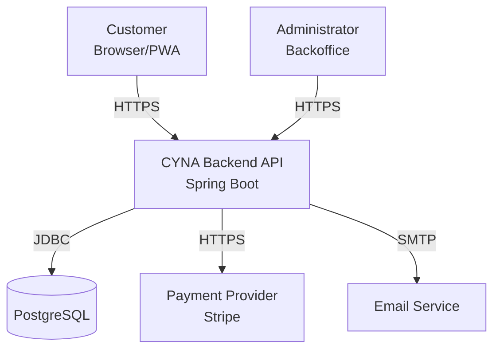
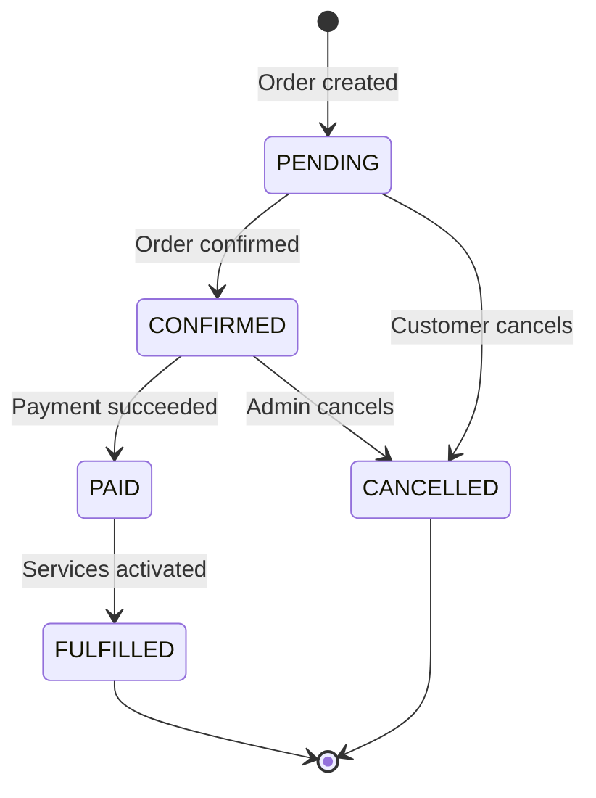
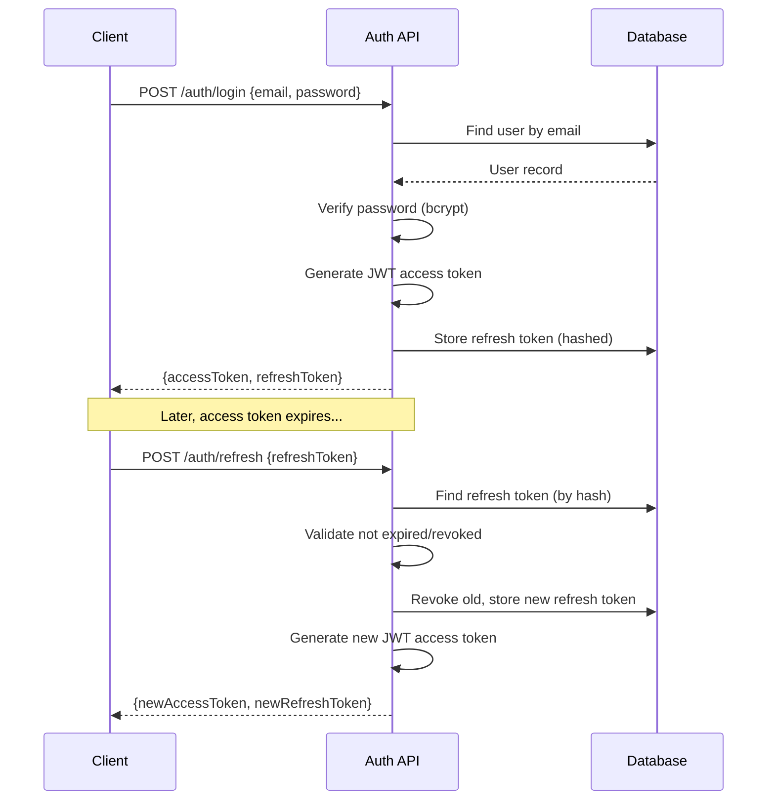
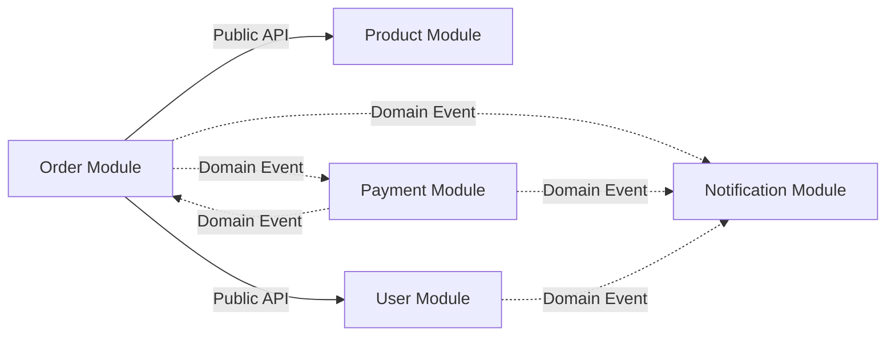

# Diagrams

## Purpose

This folder contains architecture and design diagrams for the CYNA Platform. Diagrams are maintained alongside code and should be updated when architectural decisions change.

---

## Diagram Index

| Diagram | Description | Format |
|---------|-------------|--------|
| System Context | High-level system overview showing actors and external systems | Mermaid / PNG |
| Module Dependency Map | Shows allowed dependencies between backend modules | Mermaid / PNG |
| Clean Architecture Layers | Concentric layer diagram with dependency arrows | Mermaid / PNG |
| Authentication Flow | JWT login, refresh, and token rotation sequence | Mermaid / PNG |
| Order Lifecycle | State machine for order status transitions | Mermaid / PNG |
| Domain Event Flow | Event publishing and handling across modules | Mermaid / PNG |
| Deployment Architecture | Infrastructure and deployment topology | Mermaid / PNG |

---

## Diagramming Tools

| Tool | Purpose | Format |
|------|---------|--------|
| **Mermaid** (preferred) | Inline diagrams in Markdown | `.md` / embedded |
| **Draw.io / diagrams.net** | Complex visual diagrams | `.drawio` / `.png` |
| **PlantUML** | UML diagrams (class, sequence) | `.puml` / `.png` |

### Mermaid Examples

#### System Context

#### Order State Machine

#### Authentication Sequence

#### Module Dependencies

---

## Conventions

| Convention | Rule |
|-----------|------|
| Prefer Mermaid for simple diagrams | Embedded in Markdown, version-controllable |
| Use Draw.io for complex diagrams | Export as PNG and commit both `.drawio` and `.png` |
| Name diagram files descriptively | `system-context.md`, `order-state-machine.drawio` |
| Keep diagrams up to date | Update when architecture changes |
| Include diagrams in relevant docs | Reference from architecture documents |
| Use consistent colors and shapes | Follow team conventions |

---

## Creating New Diagrams

1. Choose the appropriate tool (Mermaid for simple, Draw.io for complex).
2. Create the diagram file in this folder.
3. Update this README with the new diagram entry.
4. Reference the diagram from the relevant documentation page.
5. Include the diagram in your PR for review.

---

## Related Documents

- [Architecture Overview](../architecture/architecture-overview.md)
- [Bounded Contexts](../domain/bounded-contexts.md)
- [Authentication](../security/authentication.md)
- [Inter-Module Communication](../architecture/inter-module-communication.md)
