# Gestion des commandes et paiements — flux complet

> Document de référence du parcours d'achat et du cycle de vie d'un abonnement sur la plateforme CYNA.
> Pour la mise en place de Stripe en local, voir [stripe-onboarding](../setup/stripe-onboarding.md).
> Pour les modules individuels, voir [order-module](../modules/order-module.md), [payment-module](../modules/payment-module.md), [subscription-module](../modules/subscription-module.md).

---

## Sommaire

1. [Vue d'ensemble](#1-vue-densemble)
2. [Architecture des modules concernés](#2-architecture-des-modules-concernés)
3. [Modèle de données](#3-modèle-de-données)
4. [Cycle de vie complet](#4-cycle-de-vie-complet-vue-temporelle)
5. [Flux : achat initial (happy path)](#5-flux--achat-initial-happy-path)
6. [Flux : renouvellement automatique](#6-flux--renouvellement-automatique)
7. [Flux : annulation par le client](#7-flux--annulation-par-le-client)
8. [Flux : échec de paiement (past_due / dunning)](#8-flux--échec-de-paiement-past_due--dunning)
9. [Flux : authentification 3D Secure (SCA)](#9-flux--authentification-3d-secure-sca)
10. [Routage des webhooks Stripe](#10-routage-des-webhooks-stripe)
11. [Machines à états](#11-machines-à-états)
12. [Référence API](#12-référence-api)
13. [Entités Stripe créées et idempotence](#13-entités-stripe-créées-et-idempotence)

---

## 1. Vue d'ensemble

CYNA vend des services de cybersécurité **par abonnement**. Le client choisit un cycle de facturation (mensuel ou annuel) ; **Stripe pilote l'argent** (prélèvements automatiques, retries, dunning) ; notre backend tient l'état métier (commandes, abonnements actifs) et reste en synchro via les **webhooks**.

**Trois principes fondateurs :**

1. **Stripe est la source de vérité financière.** Les renouvellements et les annulations effectives sont déclenchés par Stripe ; notre backend réagit aux webhooks et met à jour son état local.
2. **Le webhook est le seul chemin qui crée les abonnements locaux.** La confirmation côté client (Stripe Elements) actualise l'UI, mais la logique métier (passage de l'Order en `PAID`, création des `Subscription` locales) attend la confirmation webhook.
3. **Idempotence partout.** Webhooks rejouables, commandes Stripe dédupliquées par `Idempotency-Key`, mises à jour locales tolérantes aux états déjà atteints.

---

## 2. Architecture des modules concernés

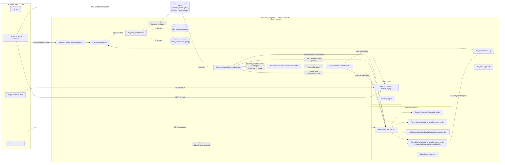

**Règles de dépendance entre modules** (vérifiées par les tests ArchUnit dans [LayerDependencyRulesTest](../../cyna-backend/src/test/java/com/cyna/architecture/LayerDependencyRulesTest.java)) :

- Subscription → Payment (via `application.api.PaymentCommandApi`) : pour annuler côté Stripe
- Payment → Subscription (via `application.api.SubscriptionCommandApi`) : pour orchestrer la création/renouvellement/annulation
- Aucun module ne dépend du `domain` ou de l'`infrastructure` d'un autre

---

## 3. Modèle de données

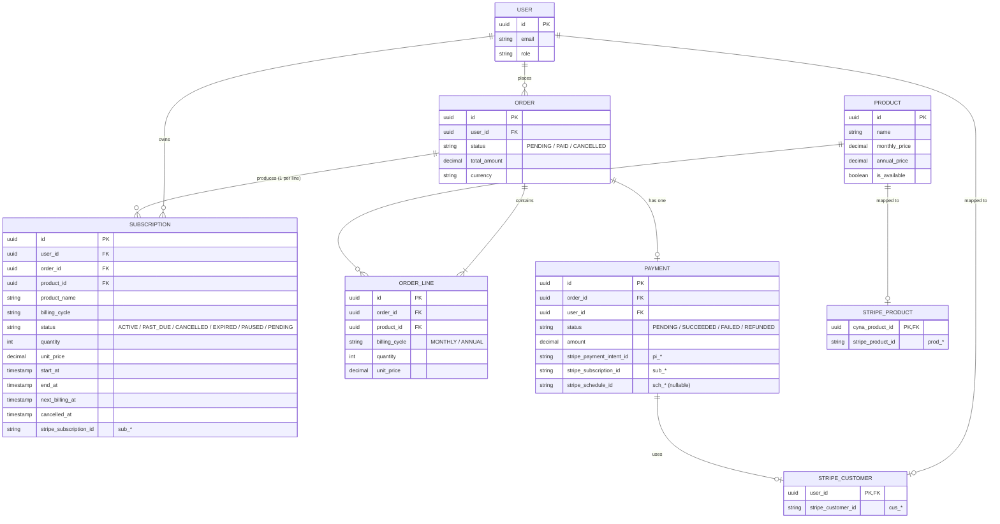

**Points clés :**

- **Une `Order` produit N `Subscription` locales** (une par ligne de commande). Toutes partagent le même `stripe_subscription_id` (un seul abonnement Stripe regroupe tous les items de la commande).
- **`stripe_customers`** mappe `user_id ↔ cus_*`. On crée le client Stripe lazily au premier checkout. Si le `cus_*` est introuvable côté Stripe (test mode reset), l'adapter détecte `resource_missing` et recrée.
- **`stripe_products`** mappe `cyna_product_id ↔ prod_*`. Persisté en DB pour éviter la duplication des Stripe Products entre redémarrages backend ou multi-instances.

Migrations correspondantes : `V1` (orders, subscriptions), `V3` (payment_schema), `V4` (stripe_subscription_id/schedule_id), `V5` (status PAST_DUE), `V6` (stripe_products).

---

## 4. Cycle de vie complet (vue temporelle)

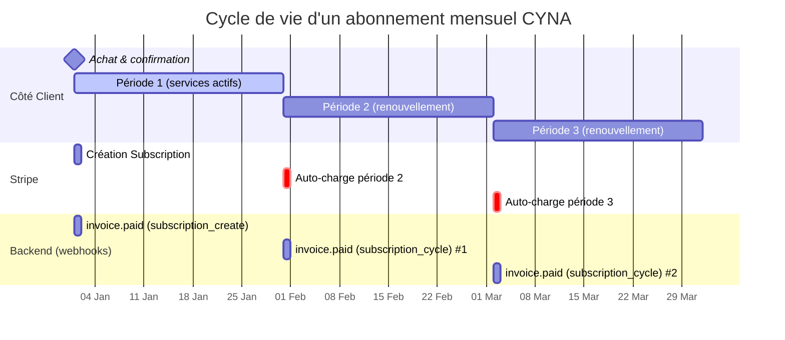

---

## 5. Flux : achat initial (happy path)

C'est le parcours "client clique S'abonner et paie avec une carte valide".

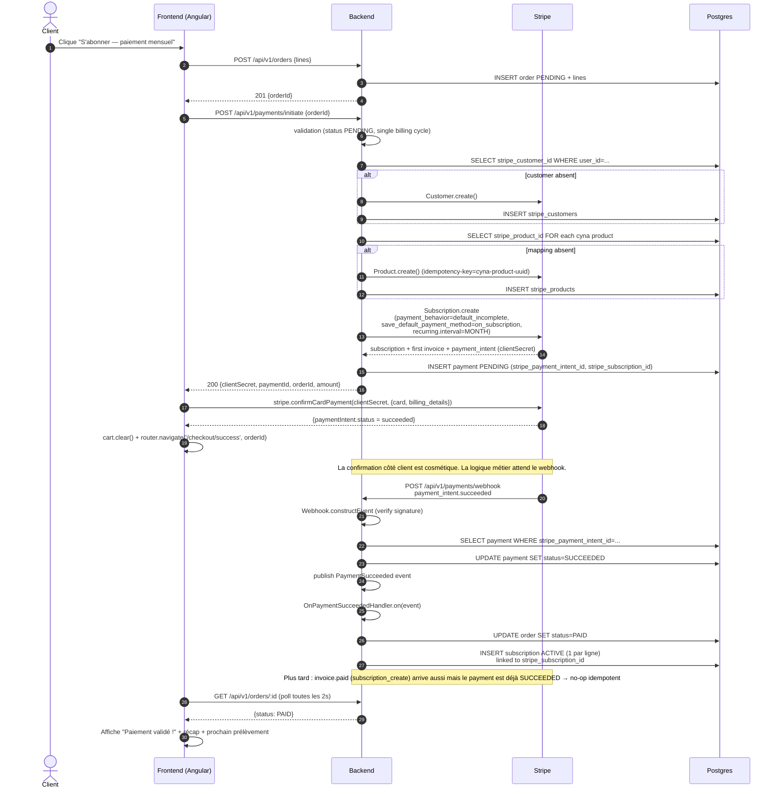

### Lecture pas à pas

Le parcours se décompose en **six phases**. La frontière critique à retenir : les phases 1 à 3 préparent le paiement et collectent la carte, mais **rien n'est encore "vrai" en local** — l'`Order` reste `PENDING`, aucune `Subscription` n'existe. C'est seulement la phase 4 (webhook) qui bascule l'état métier.

#### Phase 1 — Création de la commande (`POST /api/v1/orders`)

Le client a rempli son panier et clique "S'abonner". Le frontend envoie les lignes (produit + cycle de facturation + quantité) à `OrderController.createOrder` ([OrderController.java:42-62](../../cyna-backend/src/main/java/com/cyna/modules/order/interfaces/rest/OrderController.java#L42-L62)). Le `CreateOrderCommandHandler` ([CreateOrderCommandHandler.java](../../cyna-backend/src/main/java/com/cyna/modules/order/application/command/create/CreateOrderCommandHandler.java)) :

1. récupère les `Product` via `ProductQueryApi` (cross-module, lecture seule),
2. vérifie que chaque produit existe et est `published`,
3. calcule le `unitPrice` selon le cycle (`MONTHLY` → `monthlyPrice`, `ANNUAL` → `annualPrice`),
4. construit l'agrégat `Order` en statut `PENDING` avec ses `OrderLine`,
5. persiste et publie `OrderCreated`.

Le frontend reçoit `201 { orderId }`. **Aucun appel Stripe n'a encore eu lieu** : on a juste matérialisé l'intention d'achat côté Cyna.

#### Phase 2 — Initiation du paiement (`POST /api/v1/payments/initiate`)

C'est la phase la plus dense. `InitiatePaymentCommandHandler` ([InitiatePaymentCommandHandler.java](../../cyna-backend/src/main/java/com/cyna/modules/payment/application/command/initiate/InitiatePaymentCommandHandler.java)) orchestre, dans une seule transaction :

1. **Validation** : l'`Order` doit exister, appartenir au user authentifié et être en `PENDING` (sinon `ORDER_NOT_FOUND` / `ORDER_NOT_PAYABLE`). Toutes les lignes doivent partager le même cycle de facturation (sinon `MIXED_BILLING_CYCLES` — Stripe n'autorise qu'un seul `interval` par Subscription).
2. **Idempotence** : si un `Payment` `PENDING` existe déjà avec un `clientSecret`, on le renvoie tel quel sans rien recréer côté Stripe. Cela protège contre le double-clic, le retry réseau, ou un rechargement de la page checkout.
3. **Résolution du `cus_*`** : on cherche le mapping `user_id → stripe_customer_id` dans `stripe_customers`. S'il existe, on le réutilise. Sinon, `StripePaymentAdapter.createCustomer` ([StripePaymentAdapter.java:263-270](../../cyna-backend/src/main/java/com/cyna/modules/payment/infrastructure/stripe/StripePaymentAdapter.java#L263-L270)) crée un `Customer` Stripe avec email + nom + métadonnée `cyna_first_order_id`.
4. **Résolution des `prod_*`** : pour chaque produit, `ensureStripeProduct` ([StripePaymentAdapter.java:163-182](../../cyna-backend/src/main/java/com/cyna/modules/payment/infrastructure/stripe/StripePaymentAdapter.java#L163-L182)) lit le mapping `cyna_product_id → stripe_product_id`. Si absent, on crée le `Product` Stripe avec `Idempotency-Key = "cyna-product-{uuid}"` — cette clé garantit qu'en cas de double appel concurrent (deux checkouts simultanés du même produit après un redémarrage backend), Stripe renvoie le même `prod_*` au lieu d'en créer deux.
5. **Création de la `Subscription` Stripe** ([StripePaymentAdapter.java:68-127](../../cyna-backend/src/main/java/com/cyna/modules/payment/infrastructure/stripe/StripePaymentAdapter.java#L68-L127)) : c'est l'appel central. Trois paramètres déterminants :
   - `payment_behavior = DEFAULT_INCOMPLETE` → Stripe **ne prélève pas** immédiatement. Il crée la Subscription en statut `incomplete`, génère la première Invoice et le `PaymentIntent` associé, et expose un `clientSecret`. C'est ce mécanisme qui permet une UX moderne (Stripe Elements gère 3DS, le client voit la carte refusée *avant* qu'on déclenche quoi que ce soit en local).
   - `save_default_payment_method = ON_SUBSCRIPTION` → la carte qui valide la première facture devient automatiquement la méthode par défaut de l'abonnement, ce qui rend les renouvellements possibles sans réintervention du client.
   - `expand: latest_invoice.payment_intent` → on récupère le `PaymentIntent` directement dans la réponse au lieu de faire un second appel.
6. **Recovery `resource_missing`** ([StripePaymentAdapter.java:55-62](../../cyna-backend/src/main/java/com/cyna/modules/payment/infrastructure/stripe/StripePaymentAdapter.java#L55-L62)) : si on tente d'utiliser un `cus_*` que Stripe ne connaît plus (cas typique : reset du compte test), on attrape l'erreur, on recrée un nouveau Customer et on relance la création de Subscription.
7. **Persistance locale** : on crée un agrégat `Payment` `PENDING` portant `stripe_payment_intent_id`, `stripe_subscription_id`, `stripe_client_secret`. Si le `cus_*` a changé (création ou recovery), on upsert le mapping `stripe_customers`.

Le handler retourne `{ paymentId, orderId, clientSecret, amount, currency }`. À ce stade, **rien n'est confirmé** : l'`Order` est toujours `PENDING`, le `Payment` est `PENDING`, la Subscription Stripe est `incomplete`.

#### Phase 3 — Confirmation côté client (`stripe.confirmCardPayment`)

Le frontend prend le `clientSecret`, instancie `Stripe.js` et appelle `stripe.confirmCardPayment(clientSecret, { card, billing_details })`. **Tout se passe entre le navigateur et Stripe directement** — le numéro de carte ne traverse jamais notre backend (PCI-DSS scope minimal).

Stripe :
- valide la carte,
- déclenche 3D Secure si nécessaire (cf. [section 9](#9-flux--authentification-3d-secure-sca)),
- débite la première facture,
- attache la carte comme `default_payment_method` de la Subscription (grâce à `save_default_payment_method`).

Le frontend reçoit `{ paymentIntent.status: 'succeeded' }`, vide le panier et redirige vers `/checkout/success/:orderId`.

> **Important** : ce succès côté client est **purement cosmétique**. Tant que le webhook n'est pas arrivé, l'`Order` reste `PENDING` en base et **aucune `Subscription` Cyna n'existe**. Si le client recharge sa page d'abonnements à cet instant, il ne verra rien.

#### Phase 4 — Webhook (la vraie source de vérité)

Stripe POST `/api/v1/payments/webhook` avec l'event `payment_intent.succeeded` (et un peu plus tard, `invoice.paid` avec `billing_reason=subscription_create` — les deux mènent au même résultat).

`PaymentController.handleWebhook` ([PaymentController.java:75-90](../../cyna-backend/src/main/java/com/cyna/modules/payment/interfaces/rest/PaymentController.java#L75-L90)) délègue à `ProcessWebhookCommandHandler` ([ProcessWebhookCommandHandler.java](../../cyna-backend/src/main/java/com/cyna/modules/payment/application/command/processwebhook/ProcessWebhookCommandHandler.java)), qui :

1. **Vérifie la signature** via `Webhook.constructEvent(payload, sigHeader, webhookSecret)`. Si invalide → 400 immédiat (renvoie `INVALID_WEBHOOK_SIGNATURE`).
2. **Parse le JSON brut** au lieu d'utiliser la désérialisation typée du SDK. Raison expliquée dans [`StripePaymentAdapter.parseWebhookEvent`](../../cyna-backend/src/main/java/com/cyna/modules/payment/infrastructure/stripe/StripePaymentAdapter.java#L199-L251) : la version d'API du SDK `stripe-java` peut diverger de celle du compte Stripe (`invoice.subscription` vs `invoice.parent.subscription` selon les versions), et la désérialisation typée renverrait silencieusement `Optional.empty()`.
3. **Route vers `ProcessPaymentResultCommand`** avec `succeeded=true` et le `paymentIntentId`.

`ProcessPaymentResultCommandHandler` ([ProcessPaymentResultCommandHandler.java](../../cyna-backend/src/main/java/com/cyna/modules/payment/application/command/processresult/ProcessPaymentResultCommandHandler.java)) :

1. retrouve le `Payment` par `stripe_payment_intent_id`,
2. **idempotence** : si déjà `SUCCEEDED`, retourne `success` sans rien faire (les webhooks Stripe sont rejouables et `payment_intent.succeeded` + `invoice.paid` arrivent tous les deux pour le même paiement initial),
3. appelle `payment.markSucceeded()` qui retourne le nouvel agrégat + un événement `PaymentSucceeded`,
4. persiste et publie l'événement.

#### Phase 5 — Cascade post-paiement (`OnPaymentSucceededHandler`)

`PaymentSucceeded` est consommé **synchrone** par [`OnPaymentSucceededHandler`](../../cyna-backend/src/main/java/com/cyna/modules/payment/infrastructure/event/OnPaymentSucceededHandler.java) (annoté `@EventListener`, donc dans la même transaction que la phase 4) :

1. **`OrderCommandApi.markOrderAsPaid(orderId)`** : bascule l'`Order` de `PENDING` à `PAID`. Si ça échoue, on lève une `IllegalStateException` qui rollback toute la transaction → le webhook répond en erreur, Stripe rejouera plus tard.
2. **Recharge l'`Order`** via `OrderQueryApi.findOrderForPayment` pour avoir les lignes + le cycle de facturation.
3. **Pour chaque `OrderLine`** : calcule `endAt = startAt + 1 mois` (ou + 1 an), construit un `SubscriptionPaymentPayload` et appelle `SubscriptionCommandApi.createFromPayment(payload)`. Cela crée une `Subscription` locale en statut `ACTIVE` portant le **même `stripe_subscription_id`** pour toutes les lignes (un seul abonnement Stripe regroupe l'ensemble).

À la fin de la phase 5, l'état métier est complet : `Order = PAID`, N `Subscription` `ACTIVE`, `Payment = SUCCEEDED`.

#### Phase 6 — Polling et affichage de confirmation

Pendant tout ce temps, la page `/checkout/success/:orderId` du frontend poll `GET /api/v1/orders/:id` toutes les 2s. Tant qu'elle voit `status: PENDING`, elle affiche un spinner "Validation en cours". Dès qu'elle voit `status: PAID`, elle bascule sur l'écran "Paiement validé" avec le récapitulatif et la date du prochain prélèvement.

Cette boucle de polling est volontaire : elle découple l'UX de la latence du webhook (typiquement <1s en local avec la CLI Stripe, parfois quelques secondes en production), et reste robuste aux pertes du `payment_intent.succeeded` côté client (le webhook est garanti par Stripe, pas la callback front).

### Pourquoi ce découpage ?

- **Stripe est la source de vérité financière**, donc c'est lui qui décide quand un paiement est *vraiment* validé. La logique métier (passage `PAID`, création des `Subscription`) attend cette confirmation pour ne jamais marquer comme payé un paiement qui aurait pu être rejeté à la dernière seconde par la banque.
- **Le découplage `Payment` / `Order` / `Subscription`** via `PaymentSucceeded` permet à chaque module de rester maître de son agrégat. Le module Payment ne sait pas créer une `Subscription` ; le module Subscription ne parle jamais à Stripe directement. La colle est l'événement de domaine.
- **L'idempotence à chaque étape** (Payment existant retourné en phase 2, `Idempotency-Key` Stripe pour les Products, statut déjà-atteint no-op en phase 4) garantit qu'un retry — qu'il vienne du client, du réseau ou du replay Stripe — ne crée jamais de doublon.

**Points d'attention :**

- L'étape 12 utilise `default_incomplete` : Stripe ne tente PAS de prélever immédiatement, le `clientSecret` est exposé pour que le client confirme avec sa carte (gérant 3DS si besoin).
- L'étape 13 utilise `save_default_payment_method=on_subscription` : la carte ayant validé la première facture devient la méthode de paiement par défaut de l'abonnement Stripe → renouvellements automatiques.
- L'étape 21 (webhook → mark Payment SUCCEEDED) déclenche **dans la même transaction** la mise en `PAID` de l'order et la création des `Subscription` locales (synchronous `@EventListener` sur `PaymentSucceeded`).

---

## 6. Flux : renouvellement automatique

À chaque fin de période (J+30 pour un mensuel, J+365 pour un annuel), Stripe émet une nouvelle facture, débite la carte par défaut, et notifie via webhook.

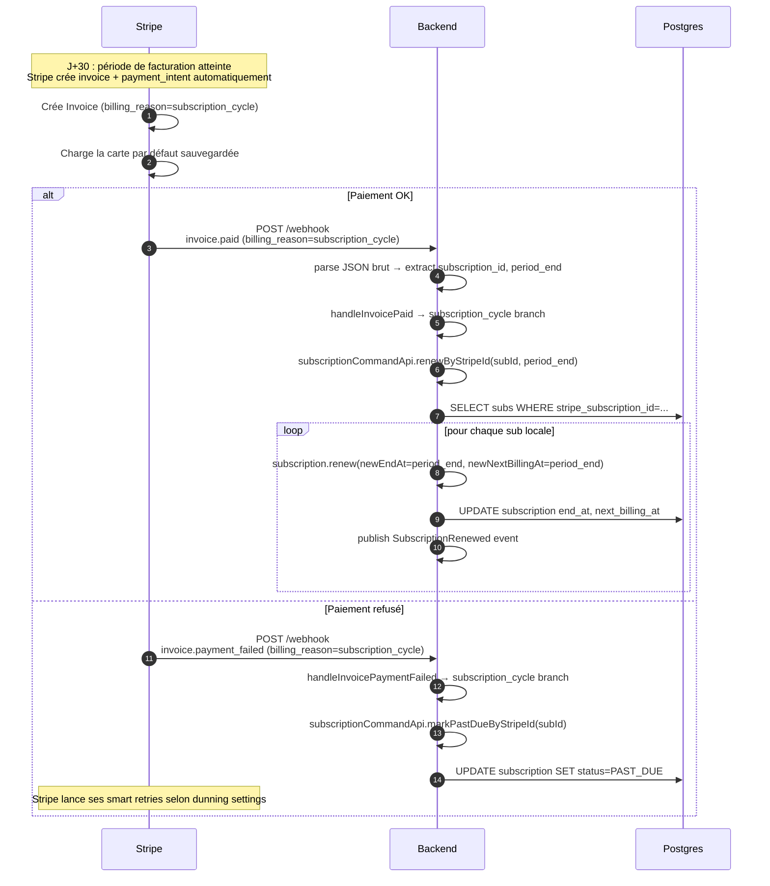

**Comportements clés :**

- **Aucune intervention humaine** : Stripe gère la facture, le débit, les retries et le dunning automatiquement. Notre backend ne fait que refléter l'état dans la DB locale.
- **Période étendue à `invoice.period_end`** : on ne calcule pas nous-même la nouvelle date — on prend celle fournie par Stripe pour rester en parfaite synchro.
- **Smart retries Stripe** : si le premier débit échoue, Stripe retente automatiquement selon la config dunning (par défaut 4 tentatives sur 4 semaines). Si le paiement réussit en cours de retry, un nouvel `invoice.paid` arrive et la sub repasse `ACTIVE` via `renew()`.

---

## 7. Flux : annulation par le client

L'annulation côté UI doit s'assurer que **Stripe arrête de prélever** ; sinon le client paierait pour un service "annulé" en local.

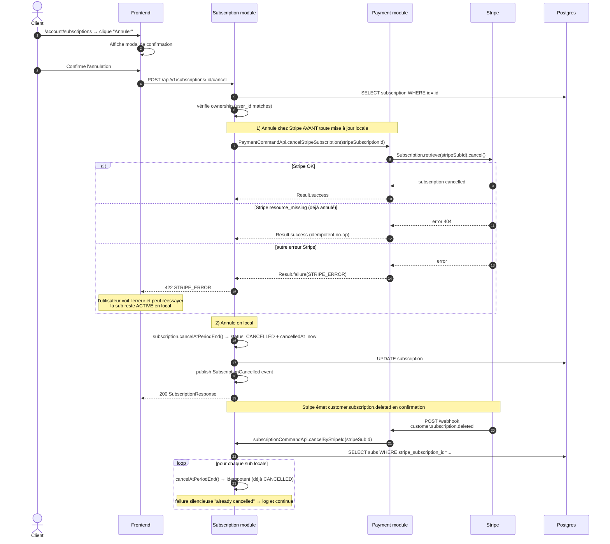

**Pourquoi appeler Stripe AVANT la mise à jour locale ?**

Pour préserver la cohérence : si on annulait localement d'abord puis l'appel Stripe échouait, le client serait "annulé" en local mais Stripe continuerait à prélever. L'inverse (échec local après succès Stripe) est moins grave : Stripe ne prélève plus, et un retry manuel ou le webhook `customer.subscription.deleted` finira de mettre à jour le local.

---

### Alternative : annulation via Stripe Customer Portal

L'utilisateur peut aussi cliquer **"Gérer mes paiements et factures"** sur `/account/subscriptions` pour ouvrir le Stripe-hosted Customer Portal et y annuler sa sub directement (en plus d'y gérer ses cartes et de télécharger ses factures).

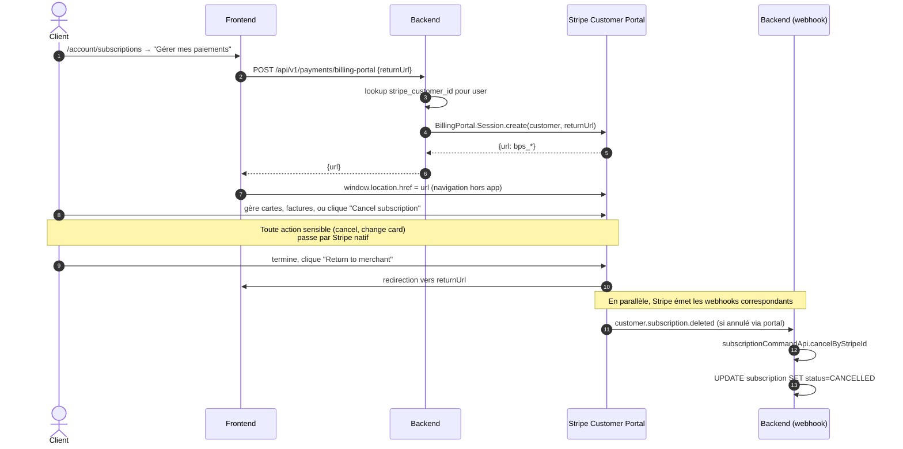

**Pourquoi cette deuxième voie ?** Stripe Customer Portal couvre **gratuitement** des écrans qu'on aurait dû coder nous-mêmes (gestion de cartes via Setup Intents, historique des factures avec PDF, etc.) et reste **conforme PCI by design** (le PAN ne touche jamais nos serveurs). Le bouton in-app sur la fiche d'abonnement reste disponible pour les utilisateurs qui préfèrent annuler sans quitter l'app.

---

## 8. Flux : échec de paiement (past_due / dunning)

Si la carte du client est refusée lors d'un renouvellement (carte expirée, fonds insuffisants, fraude détectée par la banque…), Stripe lance son cycle de relances ("dunning").

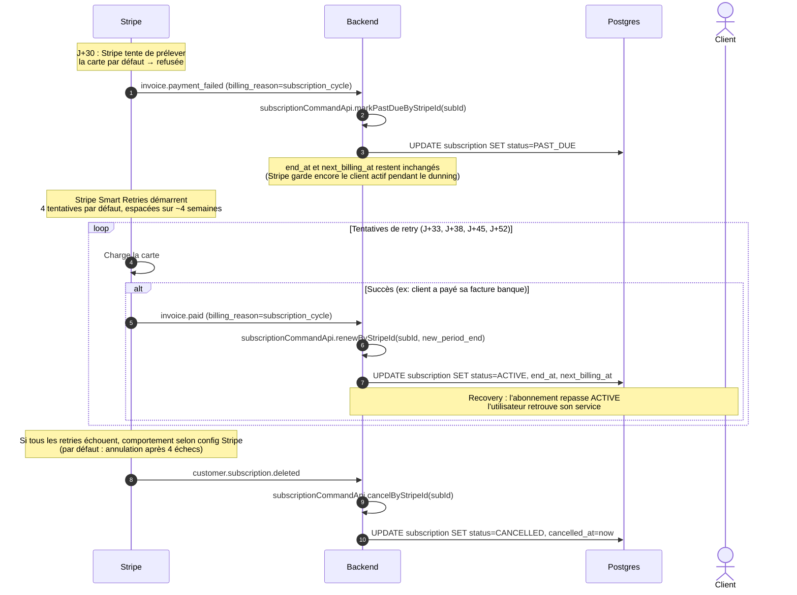

**Statut local pendant le dunning :**

| Phase | Status local | Accès produit | Visibilité utilisateur |
|---|---|---|---|
| Première tentative refusée | `PAST_DUE` | Maintenu (Stripe ne déactive pas immédiatement) | Badge orange "Paiement en retard" sur `/account/subscriptions` |
| Recovery réussie | `ACTIVE` | Maintenu | Badge vert |
| Tous retries échoués | `CANCELLED` | Coupé | Badge rouge "Annulé" |

---

## 9. Flux : authentification 3D Secure (SCA)

Pour les cartes européennes, la plupart des paiements >30€ déclenchent la SCA (Strong Customer Authentication). Stripe.js gère l'expérience native.

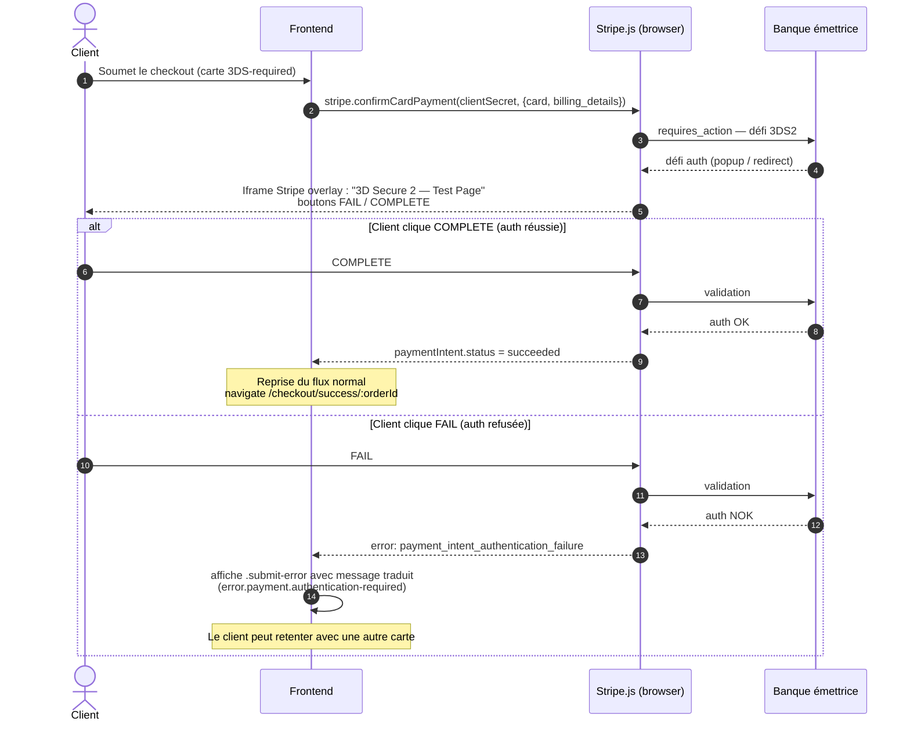

**Côté backend, rien de spécial :** Stripe gère tout dans le clientSecret. Le webhook `payment_intent.succeeded` n'arrive que si l'auth réussit. Si l'auth échoue, Stripe ne marque pas le PI comme succeeded, donc aucun webhook → aucun changement de statut côté DB.

Couverture : test e2e [40-payment-3ds.spec.ts](../../e2e/tests/40-payment-3ds.spec.ts) avec carte `4000 0025 0000 3155`.

---

## 10. Routage des webhooks Stripe

Tous les webhooks arrivent sur `POST /api/v1/payments/webhook`. La signature est vérifiée via `Webhook.constructEvent(payload, sig, webhookSecret)`. Si la sig est invalide → 400 immédiat.

> **Note importante** : `parseWebhookEvent` parse le **JSON brut** (Gson) au lieu de la désérialisation typée du SDK. Raison : le SDK `stripe-java 26.x` cible l'API version `2024-06-20` alors que les comptes Stripe récents utilisent `2025-03-31.basil` ; les schémas divergent (par ex. `invoice.subscription` est devenu `invoice.parent.subscription`), ce qui ferait échouer silencieusement la désérialisation typée.

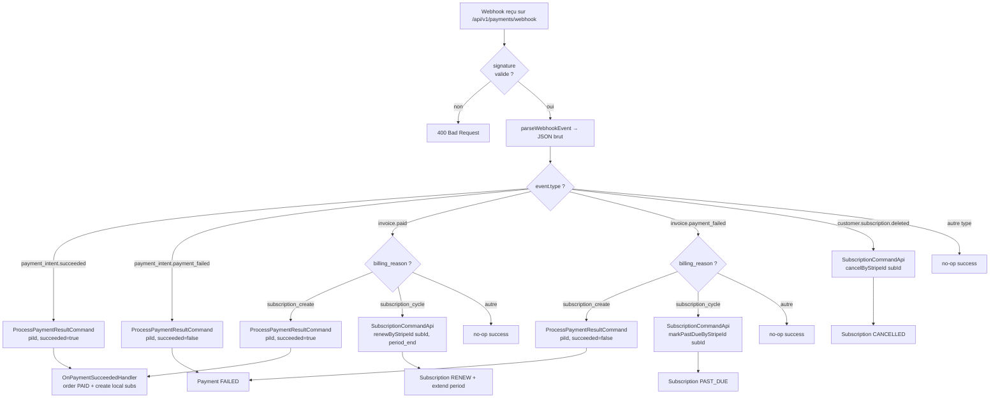

Tous les chemins retournent **200** à Stripe (sauf signature invalide → 400). Stripe rejouera tout webhook qui n'a pas reçu un 2xx, donc il est crucial que nos handlers soient idempotents.

---

## 11. Machines à états

### Order

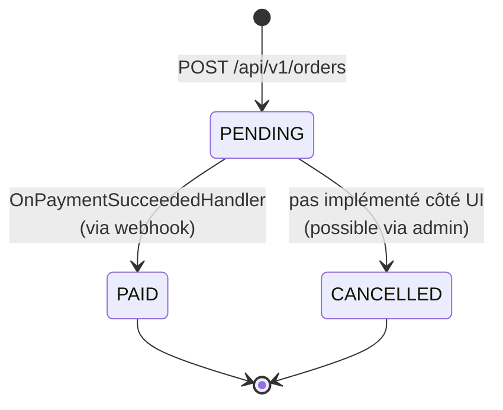

### Payment

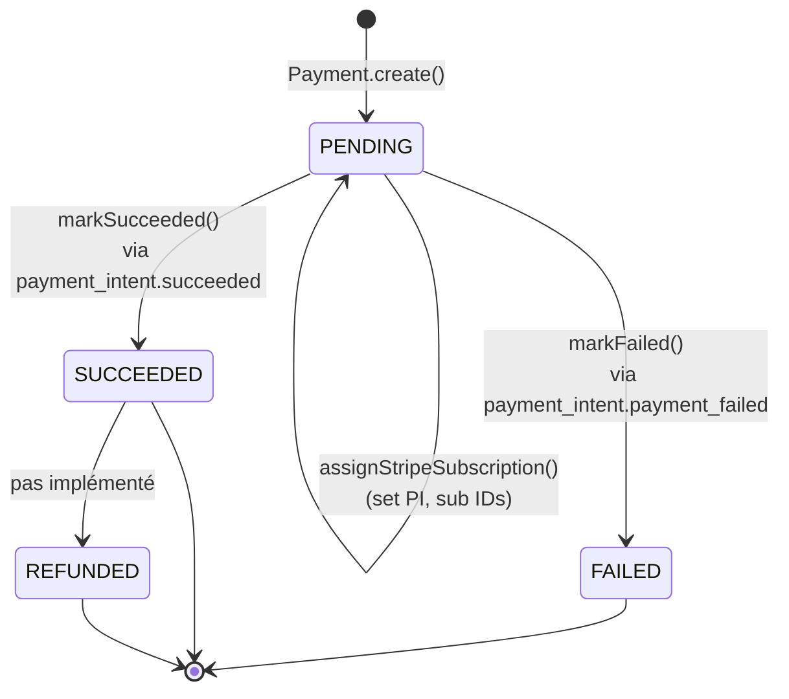

### Subscription

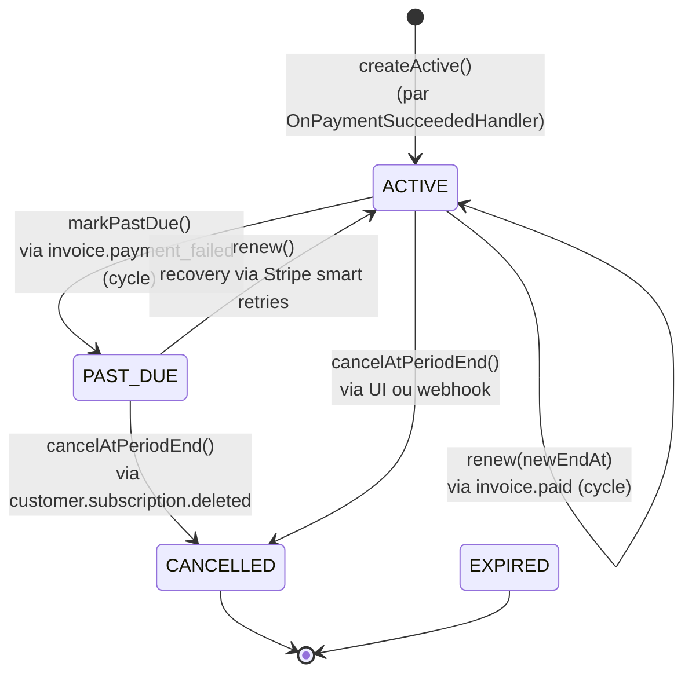

---

## 12. Référence API

### Endpoints publics consommés par le PWA

| Méthode | Endpoint | Auth | Description |
|---|---|---|---|
| `POST` | `/api/v1/orders` | Customer | Crée une order PENDING à partir des lignes du panier |
| `GET` | `/api/v1/orders/:id` | Customer (owner) | Détail d'une order. Utilisé par la page de confirmation pour poller le passage à `PAID`. |
| `POST` | `/api/v1/payments/initiate` | Customer | Crée la Subscription Stripe + Payment local PENDING. Retourne `{clientSecret, paymentId, orderId, amount, currency}`. |
| `GET` | `/api/v1/payments/order/:orderId` | Customer | Statut du paiement pour une order. |
| `POST` | `/api/v1/payments/webhook` | **public** (signature Stripe) | Endpoint webhook unique pour tous les events Stripe. |
| `POST` | `/api/v1/payments/billing-portal` | Customer | Crée une session Stripe Customer Portal (URL signée à durée limitée). Body : `{returnUrl}`. Réponse : `{url}`. Renvoie 404 `NO_STRIPE_CUSTOMER` si l'utilisateur n'a jamais payé. |
| `GET` | `/api/v1/subscriptions?page=&size=` | Customer | Liste paginée des abonnements de l'utilisateur. |
| `GET` | `/api/v1/subscriptions/:id` | Customer (owner) | Détail d'un abonnement. |
| `POST` | `/api/v1/subscriptions/:id/cancel` | Customer (owner) | Annule un abonnement (côté Stripe puis local). |

### Codes d'erreur métier

| Code | HTTP | Sens | UX frontend |
|---|---|---|---|
| `ORDER_NOT_FOUND` | 404 | Order inconnue | Toast / message "Commande introuvable" |
| `ORDER_NOT_PAYABLE` | 409 | Order pas en `PENDING` | "Cette commande n'est plus payable" |
| `MIXED_BILLING_CYCLES` | 422 | Lignes avec cycles différents | Bandeau bloquant côté panier |
| `USER_NOT_FOUND` | 404 | User incohérent (très rare) | Erreur générique |
| `NO_STRIPE_CUSTOMER` | 404 | User n'a aucun Stripe Customer (jamais payé) | Bouton "Gérer mes paiements" caché si `hasItems()` est false |
| `STRIPE_ERROR` | 502 | Erreur amont Stripe | Message générique + retry |
| `INVALID_WEBHOOK_SIGNATURE` | 400 | Signature webhook invalide | Stripe ne devrait pas voir cela |

---

## 13. Entités Stripe créées et idempotence

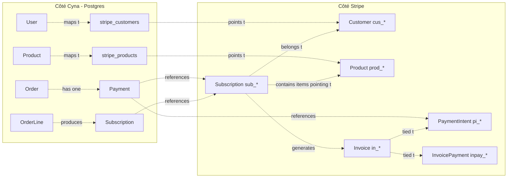

### Stratégies d'idempotence

| Source | Idempotence | Mécanisme |
|---|---|---|
| `POST /payments/initiate` | côté backend | si Payment PENDING existe avec un clientSecret pour cette order, retourné tel quel sans recréer |
| `Customer.create` | côté Stripe | recréation autorisée si stale ; le mapping est upsert si l'ID renvoyé diffère |
| `Product.create` | Stripe `Idempotency-Key` | clé = `cyna-product-{uuid}` → Stripe renvoie le même `prod_*` sur retry |
| `Subscription.create` | aucune (chaque order ⇒ une nouvelle sub Stripe) | OK car les retries du webhook ne créent pas de nouvelle sub |
| Webhooks | dans les handlers | `markSucceeded`/`markFailed`/`renew`/`cancel` retournent failure silencieuse si déjà à l'état cible → idempotent |
| `Subscription.cancel` (UI) | côté Stripe | si `resource_missing`, no-op silencieux (déjà annulée) |

---

## Voir aussi

- [stripe-onboarding](../setup/stripe-onboarding.md) — mise en place du compte Stripe + CLI pour les webhooks en local
- [order-module](../modules/order-module.md), [payment-module](../modules/payment-module.md), [subscription-module](../modules/subscription-module.md) — vues détaillées par module
- [domain-events](../domain/domain-events.md) — `PaymentSucceeded`, `SubscriptionRenewed`, `SubscriptionCancelled` etc.
- [inter-module-communication](../architecture/inter-module-communication.md) — règles entre Order / Payment / Subscription
- [tests e2e](../../e2e/tests/) — couverture Playwright (achat mensuel/annuel, mixed cycles, carte refusée, 3DS, mes abonnements, webhook end-to-end)
